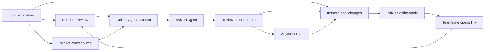
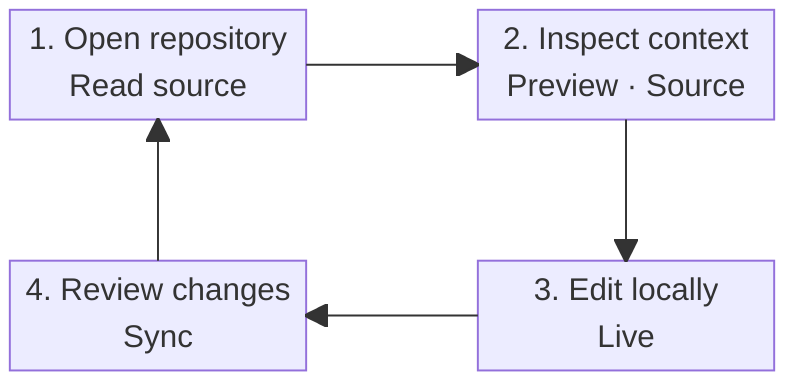
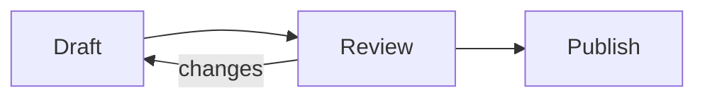

# Mermaid diagrams

This page exercises OpenGlance's local rendering of standard fenced Mermaid. The saved file remains
ordinary Markdown that agents, Obsidian, and other Mermaid-aware tools can read.

## Choose the layout for the question

Use an automatic `flowchart` for a directional process. When a complete flowchart becomes too flat or
tall to read, OpenGlance can present the complete topology from top to bottom without changing the saved
source. It does not invent node lists or isolated one-hop diagrams. Use `block-beta`, an explicit layout,
or author-defined subgraphs when placement and grouping carry meaning. If one picture still carries too
many concepts, keep the overview and move individual paths into smaller diagrams.

Fit and zoom are reading aids. They do not replace information grouping.

## A dense graph for Smart view

The fence contains ten nodes and thirteen relationships. Smart view uses only graph topology and
rendered geometry to present the complete graph vertically. It accepts the alternate view only when all
nodes, relationships, and clusters remain present and no nodes overlap.

## A balanced product workflow

The diagram is a view of the fenced source above, not a stored SVG or second diagram model.

## A short automatic process

Smart view may present this automatic process vertically for document reading. Turn it off to inspect
the author's original left-to-right rendering.

## Try the reading controls

1. In Preview, confirm that the dense flowchart opens as a complete vertical graph with ten nodes and
   thirteen relationships; no node selector or synthetic local graph appears.
2. Turn **Smart view** off and on and confirm that both views retain the same complete topology.
3. Select `+` and drag the enlarged canvas, then use **Fit width** to restore it.
4. Resize the window and confirm that the canvas does not become needlessly tall.
5. Use `</>` to inspect the exact Mermaid source, then return to the diagram.
6. Switch to Live. Outside the fenced block it remains rendered; the original text is still available
   in Live or Source for editing.
7. Change OpenGlance between light and dark appearance and confirm that the diagram follows the active
   theme without rewriting this file.

## Continue the tour

- [Markdown and Live editing](markdown-live.md)
- [MDX-lite components](mdx-lite-components.mdx)
- [Demo index](../README.md)
