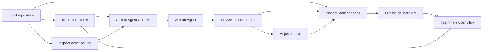
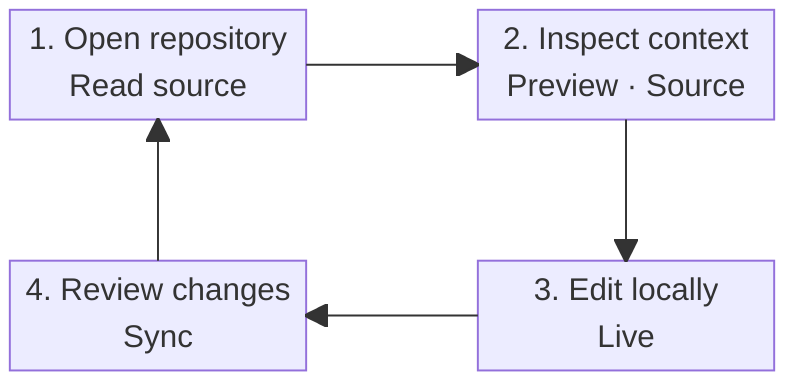
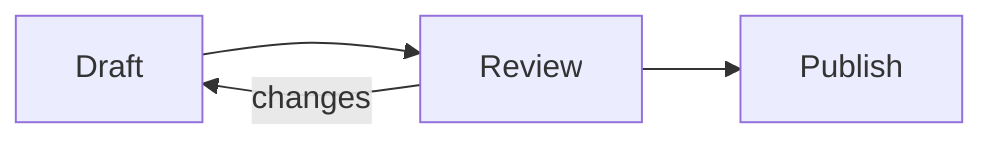

# Mermaid diagrams

This page exercises Git Leaf's local rendering of standard fenced Mermaid. The saved file remains
ordinary Markdown that agents, Obsidian, and other Mermaid-aware tools can read.

## Choose the layout for the question

Use an automatic `flowchart` for a directional process. When a complete flowchart becomes too flat or
tall to read, Git Leaf can start with one node and its direct inputs and outputs without changing the
saved source. Use `block-beta` or an explicit layout when the author's placement itself carries meaning.
If one picture still carries too many concepts, keep the overview and move individual paths into
smaller diagrams.

Fit and zoom are reading aids. They do not replace information grouping.

## A dense graph for Smart view

The fence still contains all ten nodes and thirteen relationships. Smart view uses only graph topology
and rendered geometry: it starts at a structural entry node, shows the selected node with its direct
neighbors, and states how much of the complete graph is visible. Choose another node to continue or
choose **All nodes** to restore the full topology.

## A balanced product workflow

The diagram is a view of the fenced source above, not a stored SVG or second diagram model.

## A short automatic process

Here the automatic left-to-right layout remains compact, so a manual grid would add no value.

## Try the reading controls

1. In Preview, confirm that the dense flowchart opens at **Local repository** and reports four of ten
   nodes with three direct relationships.
2. Select **Inspect local changes** and confirm that the local view changes without editing this file.
3. Choose **All nodes** and confirm that the complete graph has ten nodes and thirteen relationships.
4. Turn **Smart view** off and on, then select `+` and drag the enlarged canvas.
5. Select **Fit width**, resize the window, and confirm that the canvas does not become needlessly tall.
6. Use `</>` to inspect the exact Mermaid source, then return to the diagram.
7. Switch to Live. Outside the fenced block it remains rendered; the original text is still available
   in Live or Source for editing.
8. Change Git Leaf between light and dark appearance and confirm that the diagram follows the active
   theme without rewriting this file.

## Continue the tour

- [Markdown and Live editing](markdown-live.md)
- [MDX-lite components](mdx-lite-components.mdx)
- [Demo index](../README.md)
