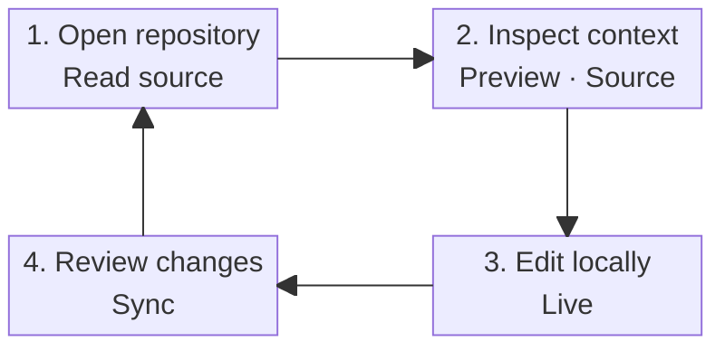
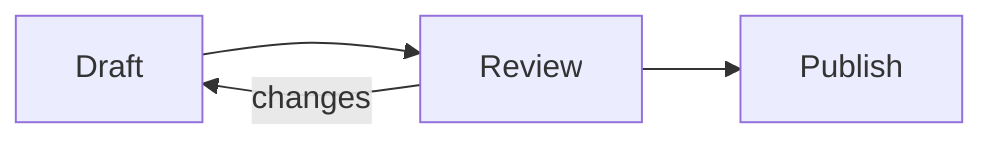

# Mermaid diagrams

This page exercises Git Leaf's local rendering of standard fenced Mermaid. The saved file remains
ordinary Markdown that agents, Obsidian, and other Mermaid-aware tools can read.

## Choose the layout for the question

Use an automatic `flowchart` for a short process with one dominant direction. Use `block-beta` when an
architecture overview needs explicit semantic columns, rows, and `space` blocks. If one picture still
carries too many details, keep the overview here and move individual paths into smaller diagrams.

Fit and zoom are reading aids. They do not replace information grouping.

## A balanced product workflow

The diagram is a view of the fenced source above, not a stored SVG or second diagram model.

## A short automatic process

Here the automatic left-to-right layout remains compact, so a manual grid would add no value.

## Try the reading controls

1. In Preview, confirm that the architecture remains readable at 100% and keeps one selectable
   source-line range.
2. Select `+`, then drag the enlarged canvas.
3. Select **Fit width** to restore the complete graph. Resize the window and confirm that the canvas
   height follows the diagram instead of leaving a large empty field.
4. Use `</>` to inspect the exact Mermaid source, then return to the diagram.
5. Switch to Live. Outside the fenced block it remains rendered; the original text is still available
   in Live or Source for editing.
6. Change Git Leaf between light and dark appearance and confirm that the diagram follows the active
   theme without rewriting this file.

## Continue the tour

- [Markdown and Live editing](markdown-live.md)
- [MDX-lite components](mdx-lite-components.mdx)
- [Demo index](../README.md)
